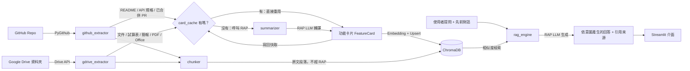

# PMEC Tool — 知識庫助理

內部知識庫工具。透過 RAG 架構，把工程團隊的 README / API 規格 / 已合併 PR，
以及（選填）Google Drive 指定資料夾內的組織文件，轉譯成知識卡片；使用者提問時，
助理先判斷問題意圖（事實查詢、進度狀態、操作說明、彙整比較、對客戶承諾評估、閒聊），
再依意圖產生回答並標註引用來源。

## 架構

```
project-root/
├── .env.example
├── requirements.txt
├── README.md
├── src/
│   ├── __init__.py
│   ├── config.py             # 載入環境變數 (RAP API, GitHub Token, Repo Name, Google Drive, ChromaDB path, 快取設定)
│   ├── documents.py          # 各來源共用的原始文件結構 ExtractedDocument
│   ├── github_extractor.py   # 透過 PyGithub 抓取 README、API 規格、近期 Merged PR
│   ├── gdrive_extractor.py   # 透過 Google Drive API（Service Account）讀取指定資料夾（含子資料夾）文件
│   ├── card_cache.py         # 把摘要過的功能卡片寫回 GitHub repo 當快取，避免重複消耗 RAP 額度
│   ├── summarizer.py         # 呼叫 RAP LLM 將 Raw Code/PR/文件轉譯為功能卡片（文件概要）
│   ├── chunker.py            # 把文件原文切成段落（試算表逐列保留欄名），供細節檢索
│   ├── vector_store.py       # ChromaDB + 本地多語 ONNX Embedding（fastembed），存放卡片與原文段落
│   ├── sync_pipeline.py      # 串接 extractor → 快取 → summarizer / chunker → vector_store 的同步協調器
│   └── rag_engine.py         # 接收提問（含先前對話），檢索卡片與原文段落，依問題意圖產生回答
├── scripts/
│   ├── check_rap_connection.py     # 手動驗證 RAP LLM 連線
│   └── check_gdrive_connection.py  # 手動驗證 Google Drive 金鑰與資料夾權限
└── app.py                    # Streamlit 介面
```

### 資料流



> 唯二會消耗國網 AI RAP 額度的步驟是 `summarizer`（產生功能卡片）與
> `rag_engine`（生成最終回答）；其餘步驟（GitHub / Google Drive 抓取、embedding、向量檢索、
> Streamlit 介面）皆免費，可部署在 Streamlit Community Cloud 免費方案上。

## 安裝

```bash
python -m venv .venv
source .venv/bin/activate  # Windows: .venv\Scripts\activate
pip install -r requirements.txt
```

## 設定

```bash
cp .env.example .env
```

編輯 `.env`，填入：

| 變數 | 說明 |
| --- | --- |
| `RAP_API_KEY` | 國網 RAP 平台 API Key |
| `RAP_BASE_URL` | RAP 端點（預設 `https://portal.genai.nchc.org.tw/api/v1`），任何相容 OpenAI SDK 的端點皆可 |
| `RAP_MODEL_NAME` | 模型名稱，例如 `Meta-Llama-3-70B-Instruct`、`Taiwan-LLM` |
| `GITHUB_TOKEN` | GitHub Personal Access Token（需有目標私有倉庫的讀取權限；若啟用快取，還需對 `CACHE_REPO` 有寫入權限） |
| `GITHUB_REPO` | 目標倉庫，格式 `owner/repo` |
| `CHROMA_PERSIST_DIR` | ChromaDB 本地儲存路徑，預設 `./chroma_data` |
| `EMBEDDING_MODEL` | 選填，fastembed 支援的 ONNX embedding 模型，預設 `sentence-transformers/paraphrase-multilingual-MiniLM-L12-v2`；更換後本地向量資料自動清空，頁面載入時從快取還原 |
| `RAG_TOP_K` | 選填，每次提問檢索的卡片＋段落數，預設 `8` |
| `CACHE_ENABLED` | 選填，是否啟用功能卡片快取，預設 `true` |
| `CACHE_REPO` | 選填，快取檔案要寫回哪個 repo（`owner/repo`）；留空 = 停用快取 |
| `CACHE_FILE_PATH` | 選填，快取檔案路徑，預設 `pmec_cache/feature_cards.json` |
| `CACHE_BRANCH` | 選填，快取檔案要寫到哪個分支；留空 = 該 repo 的預設分支 |
| `GDRIVE_FOLDER_IDS` | 選填，要同步的 Google Drive 資料夾 ID（網址 `https://drive.google.com/drive/folders/<ID>` 的 `<ID>`），多個以逗號分隔；有值即啟用 Drive 來源，連同所有子資料夾一起讀取 |
| `GDRIVE_SERVICE_ACCOUNT_JSON` | 啟用 Drive 時必填，Service Account 金鑰 JSON 檔路徑（相對路徑以專案根目錄為準，建議放 `./secrets/`，已被 `.gitignore` 排除），或直接貼上整份金鑰 JSON |
| `GDRIVE_MAX_FILES` | 選填，每次同步最多讀取的 Drive 檔案數，預設 `100`（首次同步每份文件各呼叫一次 RAP 摘要） |

> Embedding 使用 fastembed 載入 ONNX 模型（預設 `paraphrase-multilingual-MiniLM-L12-v2`，約 220MB，
> 首次啟動自動下載；支援中文、純 CPU、不需要 `torch`）。ChromaDB 內建的 `all-MiniLM-L6-v2` 只訓練英文，
> 中文查詢時內容完全對應的卡片可能排到 20 名外，因此不採用。刻意不採用 `sentence-transformers`：後者
> 會拉入 GB 等級的 torch 依賴，在 Streamlit Community Cloud 這類 1GB RAM
> 的免費部署環境容易 build 失敗或執行期 OOM。

### Google Drive（選填）

1. 在 GCP 專案啟用 **Google Drive API**，建立 Service Account 並下載 JSON 金鑰。
2. 把要同步的資料夾「共用」給金鑰內的 `client_email`（檢視者即可）；共用雲端硬碟則把 Service Account 加為成員。
3. 設定 `GDRIVE_FOLDER_IDS`、`GDRIVE_SERVICE_ACCOUNT_JSON` 後執行 `python scripts/check_gdrive_connection.py`，確認列出的文件與略過清單符合預期。

支援格式：Google 文件 / 試算表（所有工作表）/ 簡報、txt / md / csv / tsv / json、PDF（僅文字層）、docx / xlsx / pptx；
其餘格式（圖片、影片、捷徑、舊版 .doc/.xls/.ppt、掃描影像 PDF）會略過。

每份文件會產生兩種知識：
- **功能卡片**：RAP LLM 讀文件前 6,000 字寫成的概要，寫入快取；同一檔案只保留最新版本，檔案從資料夾移除後，
  下次同步（掃描完整時）即從知識庫移除。
- **原文段落**：全文（單檔上限 50 萬字，超過時同步進度會提示）切成約 300 字的段落，本地 embedding、不消耗 RAP。
  試算表與 csv / tsv 以「欄名：值｜欄名：值」逐列呈現、段落前綴帶工作表名稱，讓「P3 的資安項目」這類細節可被檢索。
  段落不寫入快取：每次同步、以及冷啟動從快取還原時，都會重新抓取 GitHub / Drive 原文重建（免費，但冷啟動需多等抓取時間）。

## 執行

```bash
streamlit run app.py
```

啟動後：

1. 於側邊欄確認「GitHub 設定」與「RAP LLM 設定」（有設定 Drive 時另有「Google Drive 設定」）皆顯示綠色（設定完整）。
2. **首次載入自動還原**：若本地 ChromaDB 是空的（例如剛部署、或 ephemeral
   檔案系統重啟後 `chroma_data/` 被清空），且 `CACHE_REPO` 已設定且上面已有
   快取內容，頁面載入時會自動從 `CACHE_REPO` 讀取快取並還原向量資料庫——
   不會呼叫 `github_extractor`、也不會呼叫 RAP LLM，通常數秒內完成，不需要
   手動點擊任何按鈕即可直接提問。若快取是空的或未設定 `CACHE_REPO`，則維持
   原本流程，需手動點擊「同步並更新」。
3. 點擊「🔄 同步並更新知識庫」：依序執行
   `github_extractor`（與 `gdrive_extractor`，若有設定）抓取 → 比對 `card_cache` → 未快取的部分交給 `summarizer`
   用 RAP LLM 轉譯功能卡片 → `vector_store` 寫入 ChromaDB → 更新後的快取寫回
   `CACHE_REPO`。用於手動抓取「新」的內容（新 PR、README/API 規格或 Drive 文件
   有變動）；本地知識庫已還原時不需要每次都點擊。
4. 於主畫面聊天輸入框提問，例如：
   - 「目前支援哪些部署方式？」
   - 「負載平衡器的逾時設定是多少？」→ 追問「那資料庫連線呢？」
   - 「我們能不能承諾客戶支援即時推送？」
5. 助理依問題類型決定回答形式，不套用固定範本：
   - 事實 / 功能查詢：直接回答有無，再說明依據。
   - 進度 / 規劃：說明目前狀態與依據。
   - 對客戶承諾：評估「可以 / 有條件可以 / 目前無法」、差距與風險，並附建議對外說法。
   - 知識庫找不到相關資料時明確說明，不臆測。

   回答以 `[n]` 標註引用，對應下方「參考資料」展開區的來源；追問時會帶入最近 3 輪對話
   （`rag_engine.MAX_HISTORY_TURNS`）。

## 常見問題

- **GitHub Token 無效 / 403**：確認 Token 未過期，且具備目標私有倉庫的 `repo` 讀取權限。
- **找不到倉庫**：確認 `GITHUB_REPO` 格式為 `owner/repo`，且 Token 帳號有該倉庫存取權。
- **RAP 連線失敗**：確認 `RAP_BASE_URL`、`RAP_API_KEY`、`RAP_MODEL_NAME` 是否正確，以及網路是否可連到 RAP 端點。
- **同步後知識庫仍為 0 筆**：可能該倉庫沒有 README、常見路徑找不到 API 規格檔，或近期沒有已合併的 PR；可調整 `src/github_extractor.py` 中的候選路徑清單。
- **重複同步會不會產生重複資料？** 不會，`vector_store.py` 依內容雜湊產生穩定 ID，採 upsert 策略覆蓋既有卡片。
- **Streamlit Community Cloud 重啟後知識庫會不會消失？** ChromaDB 本身會消失（ephemeral 檔案系統），但只要有設定 `CACHE_REPO` 且上面已有快取內容，頁面一載入就會自動偵測到本地資料庫是空的並從快取還原（不呼叫 `github_extractor`、不呼叫 RAP，數秒內完成），不需要手動點擊「同步並更新」。想抓取「新的」PR 或有變動的 README/API 規格，才需要手動點擊該按鈕——這時只有真正新增/變動的文件會重新呼叫 RAP LLM。
- **未設定 `CACHE_REPO` 會怎樣？** 功能正常，只是每次同步都會對所有抓到的文件重新呼叫 RAP LLM 摘要，等同放棄額度節省。
- **Google Drive 顯示「找不到資料夾」/ 403**：確認資料夾 ID 正確、資料夾已共用給 Service Account 的 email（`scripts/check_gdrive_connection.py` 會印出），且 GCP 專案已啟用 Google Drive API。
- **Drive 同步提示「掃描未完整」**：已達 `GDRIVE_MAX_FILES` 上限或有子資料夾讀取失敗；此時不會移除已從 Drive 刪除的舊卡片，避免誤刪後重新摘要浪費 RAP 額度。

## 授權

內部工具，僅供公司內部使用。
