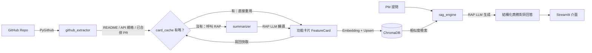

# PMEC Tool — PM ↔ GitHub 商務對齊助理

內部工具，銜接 PM 的商務語言與 GitHub 實作成果。透過 RAG 架構，把工程團隊的
README / API 規格 / 已合併 PR，轉譯成 PM 看得懂的「功能卡片」，並在 PM 提問時
產出結構化、可直接對外溝通的分析回答。

## 架構

```
project-root/
├── .env.example
├── requirements.txt
├── README.md
├── src/
│   ├── __init__.py
│   ├── config.py             # 載入環境變數 (RAP API, GitHub Token, Repo Name, ChromaDB path, 快取設定)
│   ├── github_extractor.py   # 透過 PyGithub 抓取 README、API 規格、近期 Merged PR
│   ├── card_cache.py         # 把摘要過的功能卡片寫回 GitHub repo 當快取，避免重複消耗 RAP 額度
│   ├── summarizer.py         # 呼叫 RAP LLM 將 Raw Code/PR 轉譯為商業功能卡片
│   ├── vector_store.py       # ChromaDB + 內建免費 ONNX Embedding，建立與檢索向量資料庫
│   ├── sync_pipeline.py      # 串接 extractor → 快取 → summarizer → vector_store 的同步協調器
│   └── rag_engine.py         # 接收 PM 需求，檢索實作，產出結構化商務對齊回答
└── app.py                    # Streamlit 介面
```

### 資料流



> 唯二會消耗國網 AI RAP 額度的步驟是 `summarizer`（產生功能卡片）與
> `rag_engine`（生成最終回答）；其餘步驟（GitHub 抓取、embedding、向量檢索、
> Streamlit 介面）皆免費，可部署在 Streamlit Community Cloud 免費方案上。

## 安裝

```bash
python -m venv .venv
source .venv/bin/activate  # Windows: .venv\Scripts\activate
pip install -r requirements.txt
```

## 設定

```bash
cp .env.example .env
```

編輯 `.env`，填入：

| 變數 | 說明 |
| --- | --- |
| `RAP_API_KEY` | 國網 RAP 平台 API Key |
| `RAP_BASE_URL` | RAP 端點（預設 `https://rap.genai.nchc.org.tw/api/v1`），任何相容 OpenAI SDK 的端點皆可 |
| `RAP_MODEL_NAME` | 模型名稱，例如 `Meta-Llama-3-70B-Instruct`、`Taiwan-LLM` |
| `GITHUB_TOKEN` | GitHub Personal Access Token（需有目標私有倉庫的讀取權限；若啟用快取，還需對 `CACHE_REPO` 有寫入權限） |
| `GITHUB_REPO` | 目標倉庫，格式 `owner/repo` |
| `CHROMA_PERSIST_DIR` | ChromaDB 本地儲存路徑，預設 `./chroma_data` |
| `CACHE_ENABLED` | 選填，是否啟用功能卡片快取，預設 `true` |
| `CACHE_REPO` | 選填，快取檔案要寫回哪個 repo（`owner/repo`）；留空 = 停用快取 |
| `CACHE_FILE_PATH` | 選填，快取檔案路徑，預設 `pmec_cache/feature_cards.json` |
| `CACHE_BRANCH` | 選填，快取檔案要寫到哪個分支；留空 = 該 repo 的預設分支 |

> Embedding 固定使用 ChromaDB 內建的輕量 ONNX 模型（`all-MiniLM-L6-v2`，
> 免費、純 CPU、不需要 `torch`），刻意不採用 `sentence-transformers`：後者
> 會拉入 GB 等級的 torch 依賴，在 Streamlit Community Cloud 這類 1GB RAM
> 的免費部署環境容易 build 失敗或執行期 OOM。

## 執行

```bash
streamlit run app.py
```

啟動後：

1. 於側邊欄確認「GitHub 設定」與「RAP LLM 設定」皆顯示綠色（設定完整）。
2. 點擊「🔄 同步並更新 GitHub 知識庫」：依序執行
   `github_extractor` 抓取 → 比對 `card_cache` → 未快取的部分交給 `summarizer`
   用 RAP LLM 轉譯功能卡片 → `vector_store` 寫入 ChromaDB → 更新後的快取寫回
   `CACHE_REPO`。
3. 於主畫面聊天輸入框，輸入商務問題，例如：
   - 「我們的系統有支援 CSV 批量匯入名單嗎？」
   - 「我們能不能承諾客戶支援即時推送？」
4. 系統會回傳四段式結構化分析：
   - 【能否承諾客戶】：可以 / 有條件可以 / 目前無法
   - 【現況支援程度】：非技術語言說明
   - 【差距與風險（Gap Analysis）】：規格落差與技術限制
   - 【建議對外溝通說法】：可直接對客戶發送的說法

## 常見問題

- **GitHub Token 無效 / 403**：確認 Token 未過期，且具備目標私有倉庫的 `repo` 讀取權限。
- **找不到倉庫**：確認 `GITHUB_REPO` 格式為 `owner/repo`，且 Token 帳號有該倉庫存取權。
- **RAP 連線失敗**：確認 `RAP_BASE_URL`、`RAP_API_KEY`、`RAP_MODEL_NAME` 是否正確，以及網路是否可連到 RAP 端點。
- **同步後知識庫仍為 0 筆**：可能該倉庫沒有 README、常見路徑找不到 API 規格檔，或近期沒有已合併的 PR；可調整 `src/github_extractor.py` 中的候選路徑清單。
- **重複同步會不會產生重複資料？** 不會，`vector_store.py` 依內容雜湊產生穩定 ID，採 upsert 策略覆蓋既有卡片。
- **Streamlit Community Cloud 重啟後知識庫會不會消失？** ChromaDB 本身會消失（ephemeral 檔案系統），但只要有設定 `CACHE_REPO`，`sync_pipeline` 會用 GitHub 上的功能卡片快取免費（不呼叫 RAP）重建整個向量資料庫；只有真正「新的」PR 或內容變更過的 README/API 規格才會重新呼叫 RAP LLM。
- **未設定 `CACHE_REPO` 會怎樣？** 功能正常，只是每次同步都會對所有抓到的文件重新呼叫 RAP LLM 摘要，等同放棄額度節省。

## 授權

內部工具，僅供公司內部使用。
